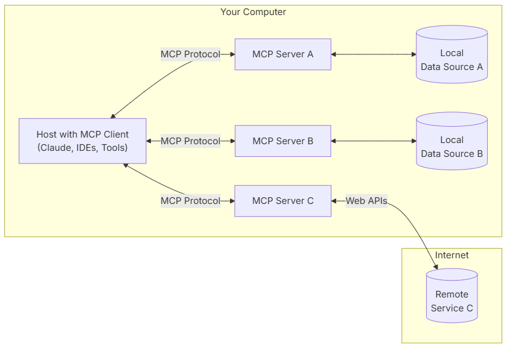

# 🚀 Model Context Protocol (MCP)

  
  
<em>MCP: The USB-C of AI Applications</em>

## 🤔 What is MCP?

MCP is an open protocol that standardizes how applications provide context to Large Language Models (LLMs). Think of it as a universal adapter for AI applications - just like how USB-C provides a standardized way to connect devices, MCP provides a standardized way to connect AI models to different data sources and tools.

## ✨ Key Benefits

- 🔌 **Plug-and-Play Integration**: Connect your LLM to various data sources and tools seamlessly
- 🔄 **Vendor Flexibility**: Switch between different LLM providers without changing your infrastructure
- 🔒 **Secure Data Handling**: Built-in best practices for securing your data
- 🛠️ **Rich Ecosystem**: Access to a growing list of pre-built integrations

## 🏗️ Architecture Overview

MCP follows a client-server architecture:

### Key Components:

- **MCP Hosts**: Programs like Claude Desktop, IDEs, or AI tools
- **MCP Clients**: Protocol clients that maintain connections with servers
- **MCP Servers**: Lightweight programs exposing specific capabilities
- **Data Sources**: Local files, databases, and remote services

## 🚀 Getting Started

### Quick Start Paths:

1. **For Server Developers** 🛠️

   - Build your own server for Claude Desktop and other clients
   - [Server Development Guide](docs/server-dev.md)

2. **For Client Developers** 💻

   - Create clients that integrate with MCP servers
   - [Client Development Guide](docs/client-dev.md)

3. **For Claude Desktop Users** 🖥️
   - Use pre-built servers in Claude Desktop
   - [User Guide](docs/user-guide.md)

## 📚 Resources

- [Example Servers](examples/servers) - Gallery of official MCP servers
- [Example Clients](examples/clients) - List of MCP-compatible clients
- [Tutorials](tutorials) - Step-by-step guides
- [Debugging Guide](docs/debugging.md) - Troubleshooting tips
- [MCP Inspector](tools/inspector) - Interactive debugging tool

## 🧠 Core Concepts

- [Architecture](docs/architecture.md) - Deep dive into MCP's design
- [Resources](docs/resources.md) - Exposing data to LLMs
- [Prompts](docs/prompts.md) - Creating reusable templates
- [Tools](docs/tools.md) - Enabling LLM actions
- [Sampling](docs/sampling.md) - Server completion requests
- [Transports](docs/transports.md) - Communication mechanisms

## 🤝 Contributing

We welcome contributions! Check out our [Contributing Guide](CONTRIBUTING.md) to learn how you can help improve MCP.

## 💬 Support & Feedback

- 🐛 **Bugs & Features**: [GitHub Issues](https://github.com/your-org/mcp/issues)
- 💡 **Spec Discussions**: [Specification Discussions](https://github.com/your-org/mcp/discussions)
- ❓ **General Help**: [Organization Discussions](https://github.com/your-org/mcp/discussions)
- 📧 **Claude Support**: [Anthropic Support Guide](https://support.anthropic.com)

## 📄 License

This project is licensed under the [MIT License](LICENSE).

---

  
Made with ❤️ by the MCP Community

